# .msgRecyclingRewards - FRONTEND

The .msgRecyclingRewards project is a secure and scalable full-stack platform designed to promote sustainable activities within communities. The application, developed as part of a competition organized by [.msg Systems Romania](https://www.msg-systems.ro/en/), provides users with the ability to actively engage with recycling centers, contribute recyclable materials, track rewards, manage vouchers, and access educational resources for a more sustainable lifestyle.

The application is divided into modules, fully Dockerized, build for multiple environments, architecture-wise it adheres to DDD and follows SOLID principles.

**Requirements:** [REQUIREMENTS.md](REQUIREMENTS.md)

***This is the FRONTEND repository of the application. In order tho access the BACKEND repository along with its documentation, please click [HERE](https://github.com/davidandw190/.msg-recycling-rewards-backend)**

## Table of Contents

- [Frontend Tech Stack](#frontend-tech-stack)
- [Gallery](#gallery)
- [TODO](#TODO)
- [License](#license)

## Gallery

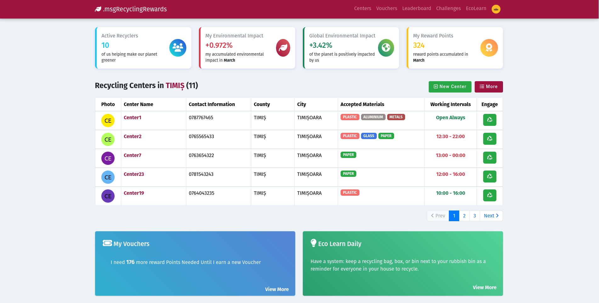

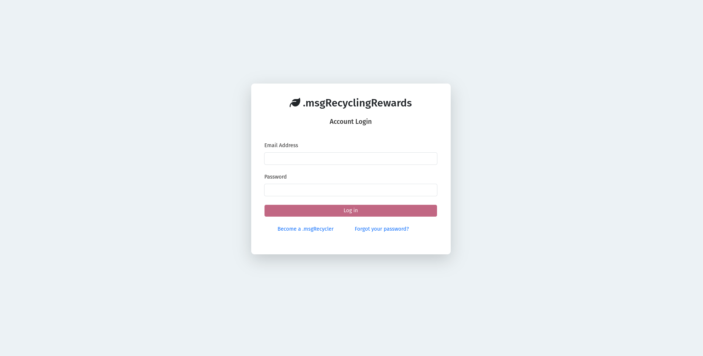

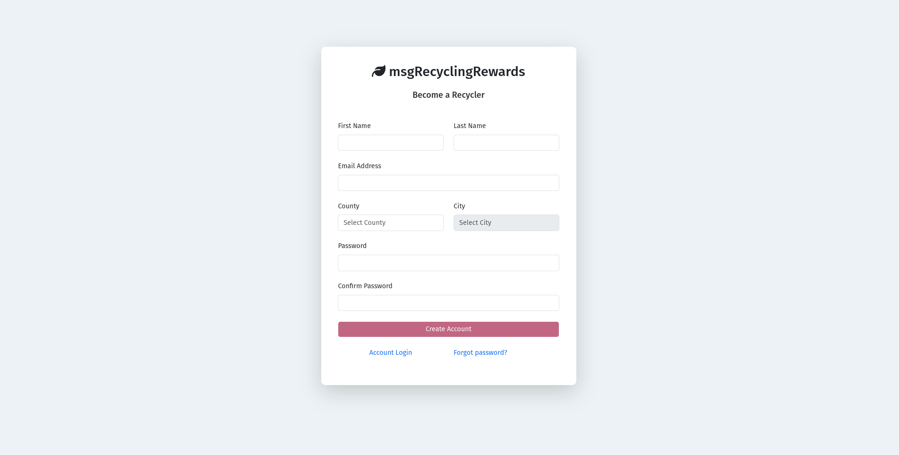

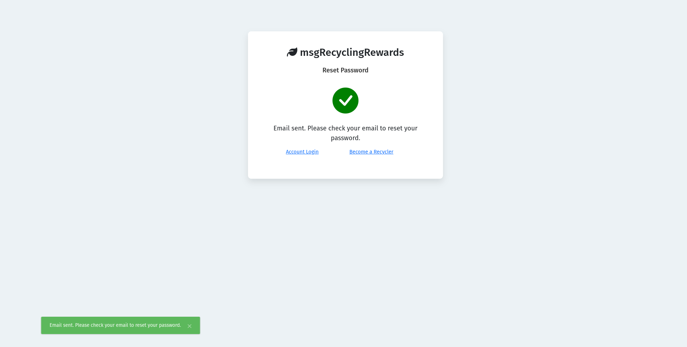

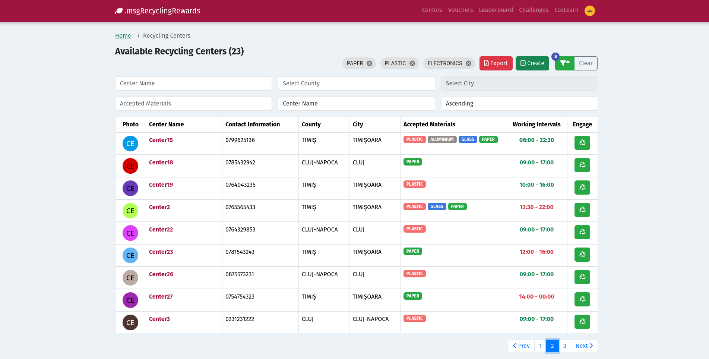

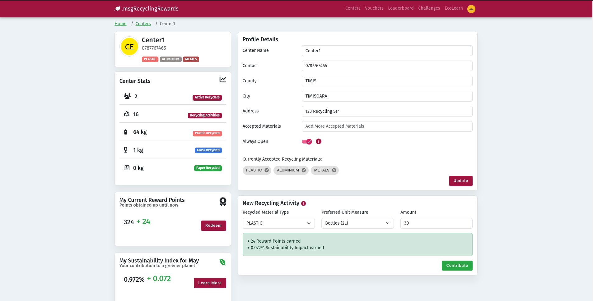

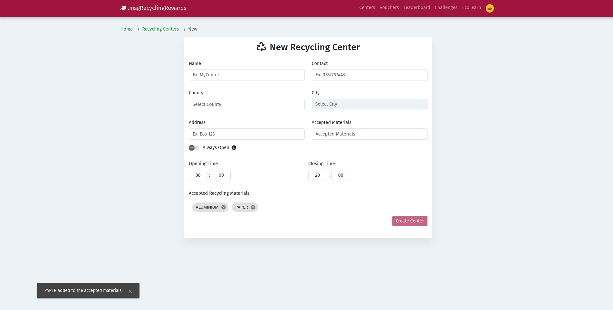

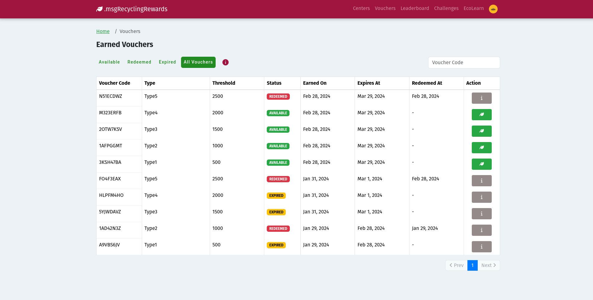

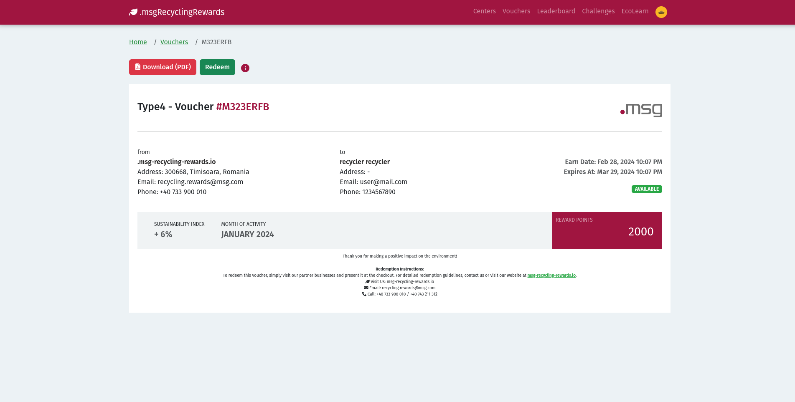

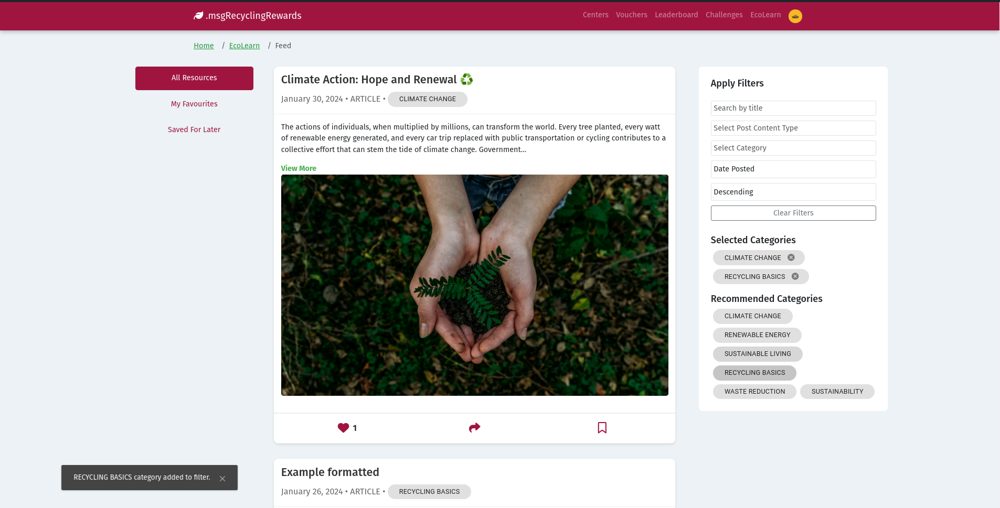

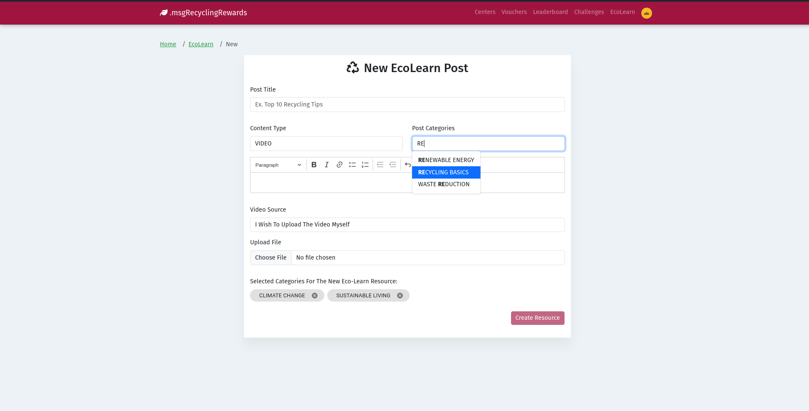

## Frontend Tech Stack

- **Angular 16.2.10**
- **RxJS 7.8**
- **Docker** 
- **NGINX**
- **AWS** (soon)

## TODO

- [x] Add Lazy-Loading
- [ ] Deploy on AWS EC2
- [ ] Integrate Security Logs
- [ ] Improve Modularity
- [ ] Integrate Redis Caching

## License

This project is licensed under the [Apache License, Version 2.0](LICENSE).
